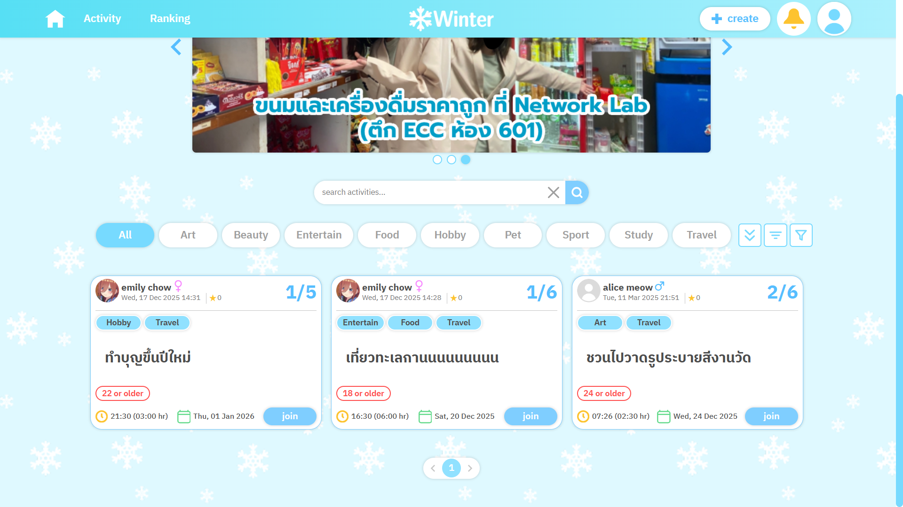
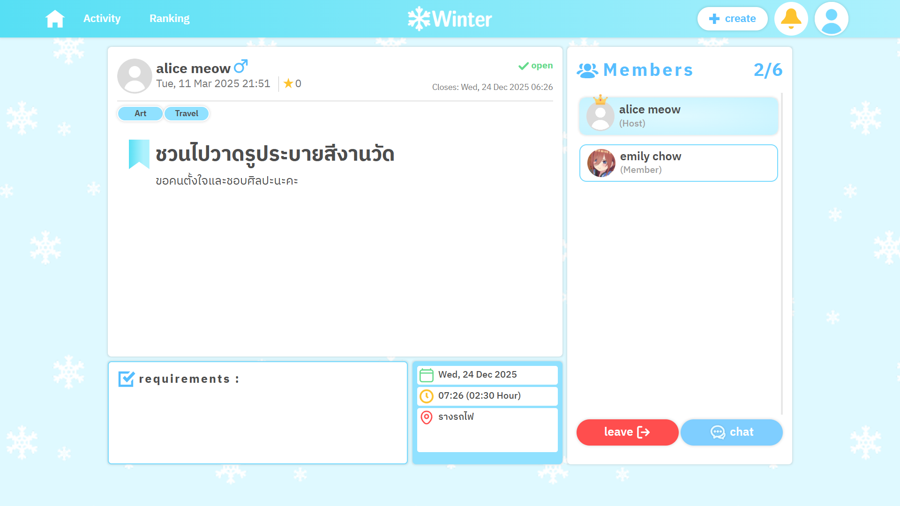
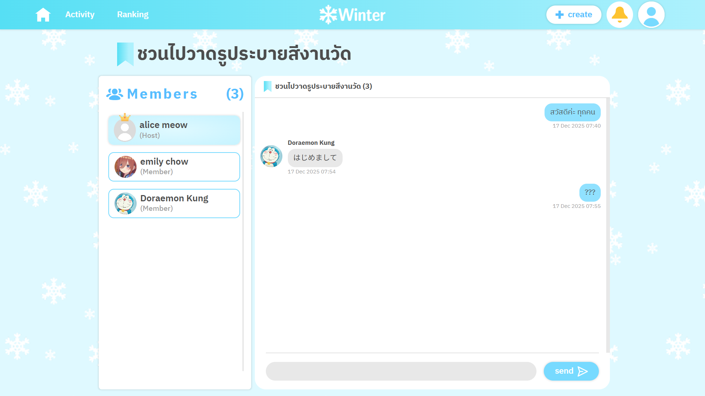

# ❄️ Winter
A website with group activity posting and joining, real-time group chat
via WebSocket, and friend management system.

## 🖼️ Demo




## 🛠️ Tech Stack
- **Frontend:** HTML, CSS, Razor
- **Backend:** ASP.NET Core MVC
- **Database:** SQLite

## ✨ Features
- **Browse Activities** - Search and view lists of available activities.
- **Post Activities** – Post activities with detailed descriptions and participation requirements.
- **Join Activities** – Join activities and get approved by the activity host.
- **Group Chat** - Chat with activity members through a group chat.
- **Friend Management** - Send, receive, and manage friend requests.
- **Comments & Ratings** – Leave comments and rate other activity members.
- **User Ranking** - View user rankings based on their ratings.
- **User Accounts** – Register, log in, manage profile.

## 🔧 Installation
Clone the repository  
   ```bash
   git clone https://github.com/jueeeeeen/Winter.git
   ```

## 🚀 How to Run
1. Run the project
    ```
    dotnet run
    ``` 
    >For development with auto-reload: `dotnet watch run`
2. Open your browser and visit

    ```
    http://127.0.0.1:5115/
    ```
